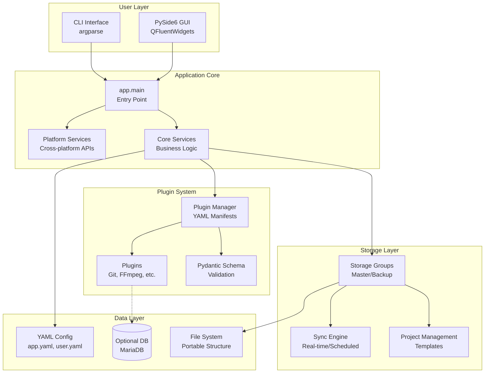
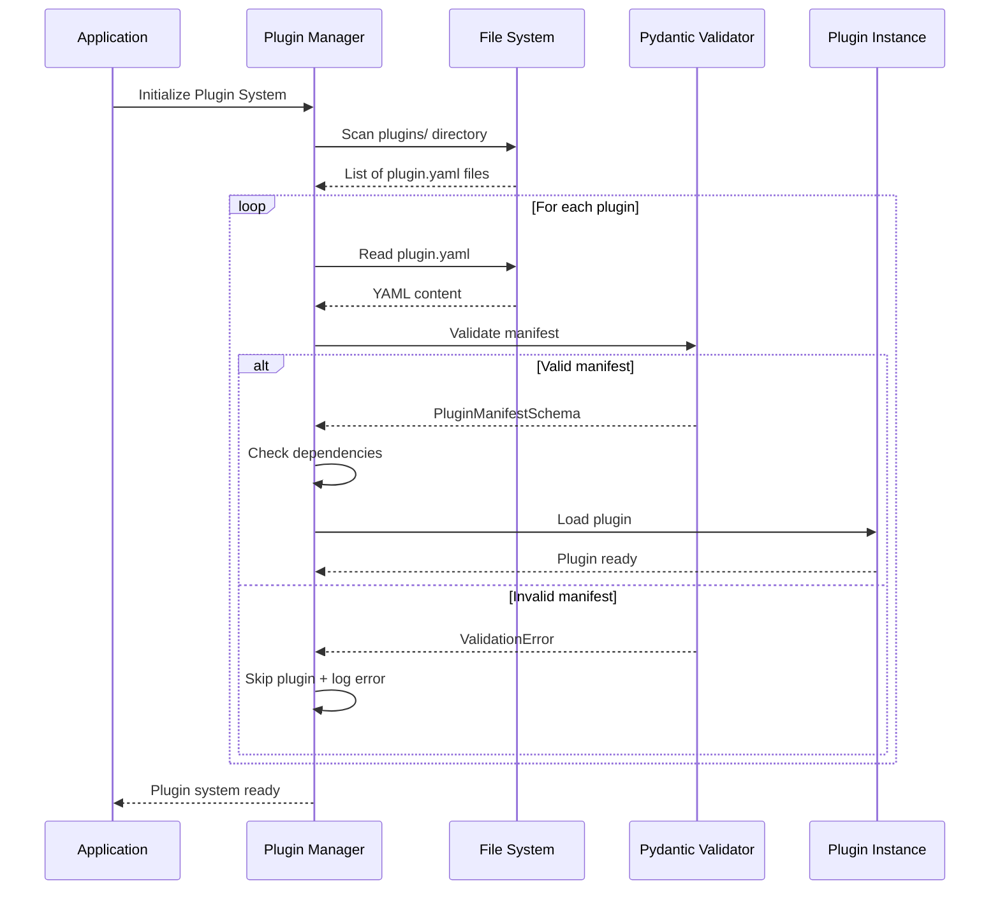
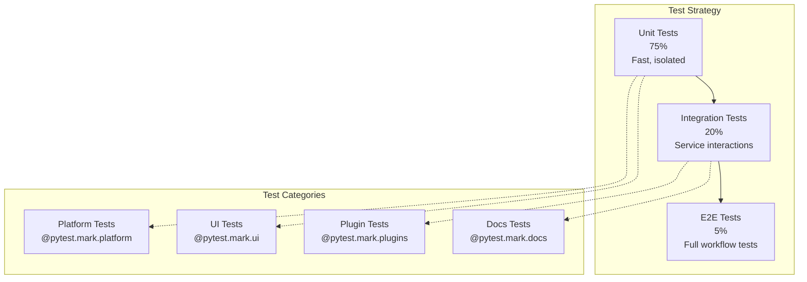
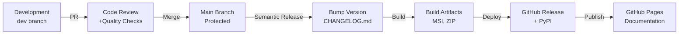

.. _developer-guide:

# Developer Guide

> **Last Updated:** 2026-01-17 21:41 UTC
\n<!-- markdownlint-disable MD013 MD033 MD041 -->

**Welcome to pyMediaManager Development!** This guide is for contributors, maintainers, and anyone interested in understanding the technical architecture and development workflow.

---

## 🎯 Quick Start for Developers

### Prerequisites

- **Python 3.12, 3.13, or 3.14** (3.13 recommended, 3.14 fully supported since October 2024)
- **Git** for version control
- **uv** package manager (10-100x faster than pip, bundled in portable distributions)
- **Just** task runner (optional but recommended)

### Setup in 3 Steps

```bash
# 1. Clone repository
git clone https://github.com/mosh666/pyMM.git
cd pyMM

# 2. Install dependencies with uv
uv sync --all-extras

# 3. Install pre-commit hooks
uv run pre-commit install

# Verify setup
uv run pytest
```

**Using Just (Recommended):**

```bash
just install    # Complete setup with one command
just check      # Run all quality checks
just test       # Run test suite
```

---

## 📊 Project Status


-yellow)


**Key Metrics:**

- **193 Tests** (all passing)
- **73% Coverage** (⚠️ sync modules have zero test coverage)
- **100% Docstring Coverage** (strict interrogate checks)
- **Type-Safe** (strict MyPy validation)
- **Zero Dependencies Issues** (automated Dependabot)

---

## 🏗️ Architecture Overview



### Key Design Principles

1. **Portability First**: Zero system modifications, runs from any drive
2. **Plugin Architecture**: Extensible via YAML manifests
3. **Type Safety**: Pydantic validation + MyPy strict mode
4. **Cross-Platform**: Windows, Linux, macOS with platform-specific optimizations
5. **Modern Python**: Uses latest 3.13 features (performance + MSI installer)

---

## 🔌 Plugin Loading Flow



**Plugin Loading Steps:**

1. **Discovery**: Scan `plugins/*/plugin.yaml`
2. **Validation**: Pydantic schema validation (schema v2)
3. **Dependency Check**: Verify required plugins available
4. **Category Assignment**: Auto-categorize by type
5. **Registration**: Add to plugin registry
6. **Initialization**: Call plugin init hooks

---

## 🧪 Test Pyramid



**Test Organization:**

- **193 Total Tests** (all passing)
  - Platform-specific tests (Windows/Linux/macOS markers)
  - UI tests with pytest-qt
  - Integration tests for service interaction
  - Unit tests for isolated components
- **⚠️ Test Coverage Gaps**: Sync engine modules (9 modules) have zero test coverage
  - See [tests/README.md](tests/README.md) for contribution priorities
- **Platform Markers**: `@pytest.mark.windows`, `@pytest.mark.linux`, `@pytest.mark.macos`
- **Timezone Reliable**: All datetime tests use UTC
- **Parallel Execution**: pytest-xdist for speed

---

## 📦 Development Workflow

### 1. Feature Development

```bash
# Create feature branch
git checkout -b feature/awesome-feature

# Make changes with hot reload
just dev

# Run tests frequently
just test-watch

# Check code quality
just check
```

### 2. Testing

```bash
# Run all tests
just test

# Run specific test file
just test-file tests/test_something.py

# Run with coverage
just test-cov

# Run platform-specific tests
just test -m windows
```

### 3. Documentation

```bash
# Update plugin catalog (auto-generated)
just update-plugin-catalog

# Build docs locally
just docs

# Serve docs for preview
just docs-serve

# Check for broken links
just docs-linkcheck
```

### 4. Building Portable Distributions

```bash
# Build for current platform (default Python 3.13)
just build

# Build with specific version/architecture/format
just build-custom 3.13 amd64 both    # Windows: ZIP + MSI
just build-custom 3.14 arm64 dmg     # macOS: DMG only

# Validate build parameters without creating files
just build-dry-run 3.13

# Test portable distribution
just test-portable 3.13
just test-portable-all               # Test all versions

# See docs/build-system.md for comprehensive guide
```

### 5. Quality Checks

```bash
# Format code
just format-all

# Lint code
just lint

# Type check
just type-check

# Check docstrings
just check-docstrings

# Security scan
just security-check

# Run all checks
just check
```

---

## 🔧 Common Development Tasks

<details>
<summary><b>Adding a New Plugin</b></summary>

1. **Create plugin directory:**

   ```bash
   mkdir -p plugins/myplugin
   ```

2. **Create `plugin.yaml` manifest:**

   ```yaml
   schema_version: 2
   name: MyPlugin
   version: 1.0.0
   description: My awesome plugin
   category: "Other"
   mandatory: false
   enabled: true
   dependencies: []
   platforms:
     windows:
       source: url
       download_url: <https://example.com/tool.zip>
       checksum_sha256: abc123...
   ```

3. **Validate plugin:**

   ```bash
   uv run python scripts/update_plugin_catalog.py --dry-run
   ```

4. **Add tests:**

   ```python
   # tests/plugins/test_myplugin.py
   def test_myplugin_loads():
       assert plugin_manager.get_plugin("myplugin") is not None
   ```

5. **Update catalog:**

   ```bash
   just update-plugin-catalog
   ```

See :ref:`plugin-development` for comprehensive guide.

</details>

<details>
<summary><b>Debugging with VS Code</b></summary>

**Launch Configuration** (`.vscode/launch.json`):

```json
{
  "version": "0.2.0",
  "configurations": [
    {
      "name": "pyMM: Launch Application",
      "type": "debugpy",
      "request": "launch",
      "module": "app",
      "console": "integratedTerminal",
      "justMyCode": false
    },
    {
      "name": "pyMM: Current Test File",
      "type": "debugpy",
      "request": "launch",
      "module": "pytest",
      "args": ["${file}", "-v"],
      "console": "integratedTerminal",
      "justMyCode": false
    }
  ]
}
```

**Debugging Tips:**

- Use breakpoints in VS Code (F9)
- Inspect variables in Debug Console
- Step through code (F10 step over, F11 step into)
- Use `breakpoint()` for Python debugger

</details>

<details>
<summary><b>Performance Profiling</b></summary>

**Profile Application Startup:**

```bash
uv run python -m cProfile -o startup.prof launcher.py
uv run python -m pstats startup.prof
```

**Profile Specific Operation:**

```python
import cProfile
import pstats

profiler = cProfile.Profile()
profiler.enable()

# Your code here
result = expensive_operation()

profiler.disable()
stats = pstats.Stats(profiler)
stats.sort_stats('cumulative')
stats.print_stats(20)
```

**Memory Profiling:**

```bash
uv pip install memory-profiler
uv run python -m memory_profiler launcher.py
```

</details>

<details>
<summary><b>Running Baseline Measurements</b></summary>

pyMM uses performance baselines to prevent regression:

```bash
# Measure current performance
uv run python scripts/measure_performance_baseline.py

# View 7-day trend (requires baseline data)
uv run python scripts/calculate_thresholds.py

# Automated via GitHub Actions
# Runs daily at 2 AM UTC across Ubuntu/Windows/macOS
```

Metrics tracked:

- Test execution time
- MyPy type checking duration
- Interrogate docstring coverage
- Ruff linting speed

</details>

---

## 🚀 Release Process



### Semantic Release

pyMM uses [semantic-release](https://github.com/semantic-release/semantic-release) for automated versioning:

**Commit Message Format:**

```text
type(scope): subject

body

footer
```

**Types:**

- `feat`: New feature (minor version bump)
- `fix`: Bug fix (patch version bump)
- `docs`: Documentation only
- `style`: Code style changes
- `refactor`: Code refactoring
- `test`: Adding tests
- `chore`: Maintenance tasks

**Breaking Changes:**

- Add `BREAKING CHANGE:` in footer (major version bump)

**Example:**

```bash
git commit -m "feat(plugins): add FFmpeg video transcoding support

Add FFmpeg plugin with hardware acceleration support.
Includes NVENC, QuickSync, and VideoToolbox backends.

Closes #123"
```

See :doc:`semantic-release` for detailed guide.

---

## 📚 Additional Resources

### Documentation

- :ref:`installation` - User installation guide
- :ref:`getting-started` - User getting started
- :ref:`features` - Application features
- :doc:`architecture` - Technical architecture
- :doc:`plugin-development` - Plugin development guide
- :doc:`api-reference` - API documentation

### Development Guides

- :doc:`getting-started-dev` - Complete development setup
- :doc:`troubleshooting` - Common issues and solutions
- :doc:`migration-guide` - Version migration guides

### External Resources

- [GitHub Repository](<https://github.com/mosh666/pyMM>)
- [Issue Tracker](<https://github.com/mosh666/pyMM/issues>)
- [Discussions](<https://github.com/mosh666/pyMM/discussions>)
- [Contributing Guidelines](../CONTRIBUTING.md)

---

## 🤝 Contributing

We welcome contributions! Here's how to get started:

1. **Fork the repository**
2. **Create a feature branch** (`git checkout -b feature/awesome-feature`)
3. **Make your changes** with tests and documentation
4. **Run quality checks** (`just check`)
5. **Commit with semantic commit messages**
6. **Push to your fork** (`git push origin feature/awesome-feature`)
7. **Open a Pull Request**

**Before submitting:**

- ✅ All tests pass (`just test`)
- ✅ Code formatted (`just format-all`)
- ✅ No lint errors (`just lint`)
- ✅ Type checks pass (`just type-check`)
- ✅ Documentation updated
- ✅ CHANGELOG entry added (if applicable)

See [CONTRIBUTING.md](../CONTRIBUTING.md) for detailed guidelines.

---

## 📝 Documentation Completeness

**Current Status:**

| Guide                 | Status              | Completeness |
| --------------------- | ------------------- | ------------ |
| Installation          | ✅ Complete         | 100%         |
| Getting Started       | ✅ Complete         | 100%         |
| Features              | ✅ Complete         | 100%         |
| Configuration         | ✅ Complete         | 100%         |
| Storage Groups        | ✅ Complete         | 100%         |
| **✨ Sync Engine**    | ✅ **NEW** Complete | 100%         |
| **✨ Templates**      | ✅ **NEW** Complete | 100%         |
| **✨ Windows Setup**  | ✅ **NEW** Complete | 100%         |
| **✨ macOS Setup**    | ✅ **NEW** Complete | 100%         |
| Plugin Catalog        | ✅ Auto-Generated   | 100%         |
| Architecture          | ✅ Complete         | 95%          |
| Plugin Development    | ✅ Complete         | 100%         |
| API Reference         | ✅ Complete         | 100%         |
| Developer Guide       | ✅ Complete         | 100%         |

### Overall Documentation: 99%

**New Documentation:**

- **[Sync Engine Guide](docs/sync-engine.md)** - Comprehensive sync documentation (manual, scheduled, real-time)
- **[Project Templates](docs/templates.md)** - Template system and custom template creation
- **[Windows Setup](docs/windows-setup.md)** - MSI installer, UAC, WMI, Windows-specific features
- **[macOS Setup](docs/macos-setup.md)** - DMG installation, Gatekeeper, disk permissions

---

## 🎓 Learning Path

**For New Contributors:**

1. **Week 1**: Read :ref:`installation` and :doc:`getting-started-dev`
2. **Week 2**: Study :doc:`architecture` and codebase structure
3. **Week 3**: Pick a "good first issue" and implement it
4. **Week 4**: Submit your first PR!

**For Plugin Developers:**

1. Read :doc:`plugin-development`
2. Study existing plugins in `plugins/` directory
3. Create simple plugin (e.g., tool wrapper)
4. Add tests and documentation
5. Submit plugin to catalog

**For Core Contributors:**

1. Master the architecture and design patterns
2. Understand CI/CD pipeline and release process
3. Review PRs and mentor new contributors
4. Propose and implement major features

---

**Last Updated:** January 14, 2026
**Version:** 1.0.0
**Maintainers:** [@mosh666](https://github.com/mosh666)
