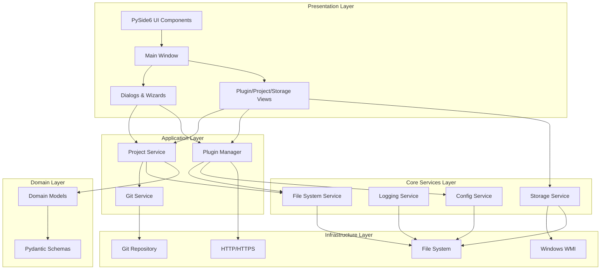
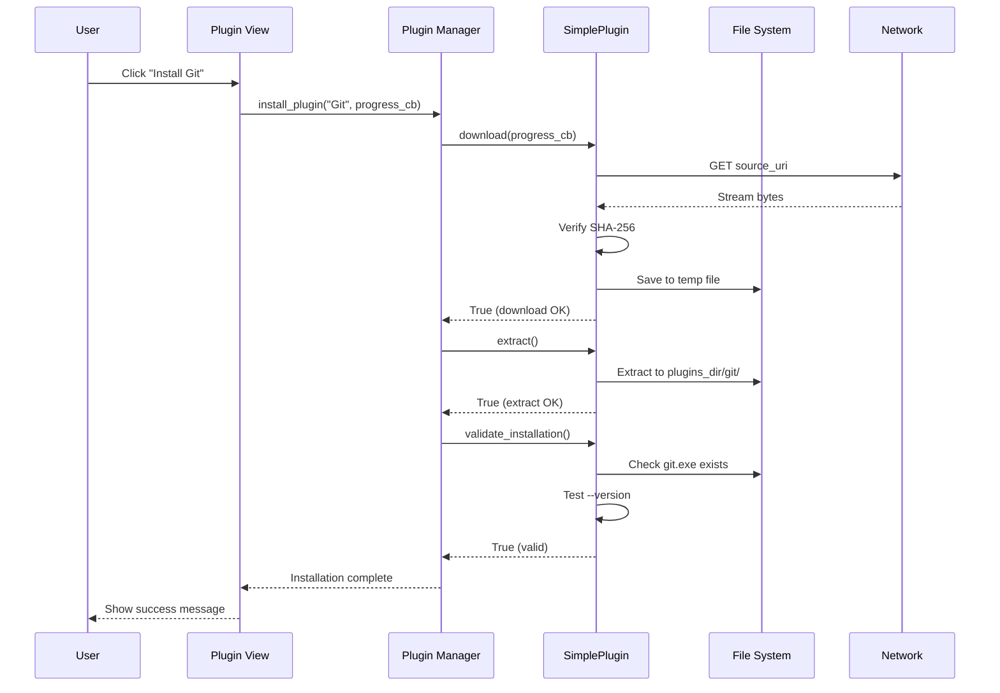
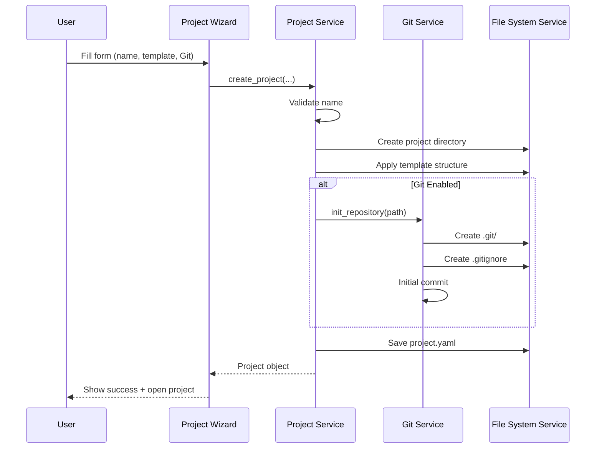
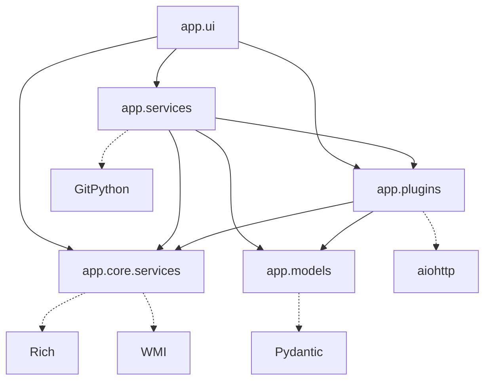

<!-- markdownlint-disable MD013 MD022 MD031 MD032 MD033 MD036 MD040 MD051 MD060 -->

# 🏗️ Architecture Documentation

> **Project:** pyMediaManager (pyMM) v1.0.0
> **Python Support:** 3.12, 3.13, 3.14 (Python 3.13 recommended)
> **Last Updated:** January 7, 2026
> **Status:** ✅ Production Ready (193 tests, 73% coverage)

## 📚 Table of Contents

- [Overview](#overview)
- [High-Level Architecture](#high-level-architecture)
- [Core Components](#core-components)
- [Data Flow](#data-flow)
- [Design Patterns](#design-patterns)
- [Technology Stack](#technology-stack)
- [Directory Structure](#directory-structure)
- [Module Dependencies](#module-dependencies)
- [Security Architecture](#security-architecture)
- [Testing Strategy](#testing-strategy)
- [Performance Considerations](#performance-considerations)
- [Extension Points](#extension-points)

---

## 🎯 Overview

pyMediaManager (pyMM) is a **portable, Python-based media management application** designed to run entirely from external drives (USB, portable HDDs) without requiring system installation. The architecture emphasizes:

- **🚀 Portability**: Zero system footprint, runs from any drive
- **🔒 Type Safety**: Modern Python with full type hints using native generics
- **🧩 Modularity**: Clean separation of concerns with dependency injection
- **🔌 Extensibility**: Plugin-based architecture for external tools
- **⚡ Performance**: Async operations, lazy loading, resource pooling
- **🧪 Testability**: 193 tests with 73% coverage using pytest

### Key Architectural Principles

1. **Separation of Concerns**: Clear boundaries between UI, business logic, and data layers
2. **Dependency Injection**: Services injected via constructor, no global state
3. **Single Responsibility**: Each module has one well-defined purpose
4. **Open/Closed Principle**: Extensible through plugins without modifying core
5. **Type Safety**: Strict MyPy checks with `list[T]`, `dict[K, V]` syntax
6. **Fail-Fast**: Early validation with Pydantic models

---

## 🏛️ High-Level Architecture



### Layer Responsibilities

| Layer | Responsibility | Technologies |
|-------|---------------|--------------|
| **Presentation** | User interface, event handling, view rendering | PySide6, QFluentWidgets |
| **Application** | Business logic, orchestration, workflows | Python 3.13, asyncio |
| **Core Services** | Cross-cutting concerns, infrastructure | YAML, Rich, Pydantic |
| **Domain** | Business entities, validation rules | Dataclasses, Pydantic |
| **Infrastructure** | External integrations, I/O operations | aiohttp, GitPython, WMI |

---

## 🧩 Core Components

### 1. Configuration Service (`app/core/services/config_service.py`)

**Purpose**: Layered configuration management with environment and user overrides.

```python
class ConfigService:
    """
    Manages application configuration with three layers:
    1. Default config (built-in)
    2. Environment config (config/app.yaml)
    3. User config (storage device config/user.yaml)
    """

    def __init__(self, app_dir: Path, storage_dir: Path | None = None):
        self.app_dir = app_dir
        self.storage_dir = storage_dir
        self.config: AppConfig = self._load_config()

    def _load_config(self) -> AppConfig:
        """Load and merge configuration layers."""
        # 1. Start with defaults from Pydantic models
        config = AppConfig()

        # 2. Override with environment config
        env_config = self.app_dir / "config" / "app.yaml"
        if env_config.exists():
            config = self._merge_config(config, env_config)

        # 3. Override with user config (highest priority)
        if self.storage_dir:
            user_config = self.storage_dir / "config" / "user.yaml"
            if user_config.exists():
                config = self._merge_config(config, user_config)

        return config
```

**Key Features**:
- ✅ Type-safe configuration with Pydantic models
- ✅ Hierarchical config merging
- ✅ Sensitive field redaction in logs
- ✅ Runtime config updates with validation

---

### 2. Plugin Manager (`app/plugins/plugin_manager.py`)

**Purpose**: Discover, install, and manage external tool plugins.

```python
class PluginManager:
    """
    Plugin lifecycle management:
    - Discovery: Load YAML manifests from plugins/ directory
    - Validation: Pydantic schema validation (fail-fast)
    - Installation: Download, verify checksum, extract
    - Execution: PATH registration, version detection
    """

    def __init__(self, plugins_dir: Path, manifests_dir: Path):
        self.plugins_dir = plugins_dir  # e.g., D:\pyMM.Plugins
        self.manifests_dir = manifests_dir  # e.g., ./plugins
        self.plugins: dict[str, PluginBase] = {}
        self.manifests: dict[str, PluginManifest] = {}

    def discover_plugins(self) -> int:
        """
        Discover plugins from YAML manifests.

        Returns:
            Number of plugins discovered
        """
        manifest_files = self.manifests_dir.rglob("plugin.yaml")
        for manifest_file in manifest_files:
            manifest = self._load_manifest(manifest_file)
            plugin = SimplePluginImplementation(manifest, self.plugins_dir)
            self.plugins[manifest.name] = plugin
        return len(self.plugins)

    async def install_plugin(
        self,
        plugin_name: str,
        progress_callback: Callable[[int, int], None] | None = None
    ) -> bool:
        """
        Install plugin with progress tracking.

        Args:
            plugin_name: Name of plugin to install
            progress_callback: Optional (current_bytes, total_bytes) -> None

        Returns:
            True if installation succeeded
        """
        plugin = self.plugins.get(plugin_name)
        if not plugin:
            return False

        # Download with SHA-256 verification
        if not await plugin.download(progress_callback):
            return False

        # Extract to plugin directory
        if not await plugin.extract():
            return False

        # Validate installation
        return plugin.validate_installation()
```

**Key Features**:
- ✅ Manifest-driven (no code execution during load)
- ✅ SHA-256 checksum verification
- ✅ Async downloads with progress tracking
- ✅ Retry logic with exponential backoff
- ✅ GitHub release asset support

**Plugin Manifest Schema** (`plugin.yaml`):

```yaml
name: Git
version: 2.47.1
description: Distributed version control system
homepage: https://git-scm.com
mandatory: false
enabled: true

source:
  type: github  # or 'url' for direct downloads
  uri: git-for-windows/git
  asset_pattern: "PortableGit-*-64-bit.7z.exe"
  checksum_sha256: "abc123..."
  file_size: 52428800

command:
  path: cmd
  executable: git.exe
  register_to_path: true

dependencies: []
```

---

### 3. Storage Service (`app/core/services/storage_service.py`)

**Purpose**: External drive detection and validation for portable operation.

```python
class StorageService:
    """
    Detects and validates external storage devices using:
    - WMI queries (Win32_LogicalDisk, Win32_DiskDrive)
    - Drive type enumeration (USB, removable)
    - Performance heuristics (read/write speed)
    """

    def get_external_drives(self) -> list[DriveInfo]:
        """
        Get all external drives using WMI.

        Returns:
            List of DriveInfo objects with metadata
        """
        import wmi
        c = wmi.WMI()

        drives = []
        for disk in c.Win32_LogicalDisk(DriveType=2):  # Removable
            drives.append(DriveInfo(
                letter=disk.DeviceID,
                label=disk.VolumeName or "Unknown",
                filesystem=disk.FileSystem,
                total_size=int(disk.Size or 0),
                free_space=int(disk.FreeSpace or 0),
                drive_type="Removable"
            ))

        for disk in c.Win32_LogicalDisk(DriveType=3):  # Fixed
            # Check if actually external via bus type
            if self._is_external_fixed_drive(disk):
                drives.append(...)

        return drives

    def _is_external_fixed_drive(self, disk) -> bool:
        """Detect external fixed drives (USB HDDs) vs internal."""
        # Query Win32_DiskDriveToDiskPartition association
        # Check InterfaceType for USB/1394
        ...
```

**Key Features**:
- ✅ WMI-based drive detection (Windows)
- ✅ USB vs internal drive discrimination
- ✅ Drive health monitoring
- ✅ Real-time removal detection

---

### 4. Project Service (`app/services/project_service.py`)

**Purpose**: Project lifecycle management with optional Git integration.

```python
class ProjectService:
    """
    Project management operations:
    - Create: Initialize directory structure + metadata
    - Load: Deserialize project.yaml
    - Update: Modify metadata with validation
    - Delete: Remove project directory
    - Git Integration: Optional repository initialization
    """

    def __init__(
        self,
        projects_dir: Path,
        git_service: GitService,
        file_system_service: FileSystemService
    ):
        self.projects_dir = projects_dir
        self.git_service = git_service
        self.fs_service = file_system_service

    def create_project(
        self,
        name: str,
        description: str = "",
        template: str | None = None,
        enable_git: bool = False
    ) -> Project:
        """
        Create new project with optional Git repository.

        Args:
            name: Project name (validated, no special chars)
            description: Project description
            template: Template name (e.g., 'video', 'photo')
            enable_git: Initialize Git repository

        Returns:
            Project object with metadata

        Raises:
            ValueError: If project name invalid or already exists
        """
        # Validate name
        if not self._validate_project_name(name):
            raise ValueError(f"Invalid project name: {name}")

        # Create directory structure
        project_path = self.projects_dir / name
        if project_path.exists():
            raise ValueError(f"Project already exists: {name}")

        project_path.mkdir(parents=True)

        # Apply template if specified
        if template:
            self._apply_template(project_path, template)

        # Initialize Git if requested
        if enable_git:
            self.git_service.init_repository(project_path)

        # Create metadata
        project = Project(
            name=name,
            path=str(project_path),
            description=description,
            created_at=datetime.now(UTC),
            git_enabled=enable_git
        )

        # Save project.yaml
        self._save_metadata(project)

        return project
```

**Project Templates**:

| Template | Structure | Features |
|----------|-----------|----------|
| `video` | `raw/`, `edited/`, `exports/`, `scripts/` | FFmpeg presets |
| `photo` | `raw/`, `processed/`, `exports/`, `archives/` | DigiKam integration |
| `audio` | `recordings/`, `mixed/`, `masters/` | Audio plugin configs |

---

### 5. Git Service (`app/services/git_service.py`)

**Purpose**: Git repository management for project version control.

```python
class GitService:
    """
    Git operations using GitPython:
    - Repository initialization with .gitignore
    - Branch management
    - Commit creation
    - Status queries
    """

    def init_repository(self, path: Path) -> bool:
        """
        Initialize Git repository with default configuration.

        Args:
            path: Project directory path

        Returns:
            True if successful
        """
        from git import Repo

        try:
            repo = Repo.init(path)

            # Create default .gitignore
            gitignore = path / ".gitignore"
            gitignore.write_text(
                "*.tmp\n"
                "*.log\n"
                ".DS_Store\n"
                "Thumbs.db\n"
            )

            # Initial commit
            repo.index.add([".gitignore"])
            repo.index.commit("Initial commit")

            return True
        except Exception as e:
            self.logger.error(f"Failed to init repository: {e}")
            return False
```

---

### 6. Logging Service (`app/core/logging_service.py`)

**Purpose**: Structured logging with console and file outputs.

```python
class LoggingService:
    """
    Multi-handler logging system:
    - Console: Rich formatting with colors/emojis
    - File: Rotating logs (10MB max, 5 backups)
    - Structured: JSON output option
    """

    def setup_logging(self, config: LoggingConfig, logs_dir: Path) -> None:
        """
        Configure root logger with handlers.

        Args:
            config: Logging configuration from ConfigService
            logs_dir: Directory for log files
        """
        root_logger = logging.getLogger()
        root_logger.setLevel(getattr(logging, config.level.value))

        # Console handler with Rich
        if config.console_enabled:
            from rich.logging import RichHandler
            console_handler = RichHandler(
                rich_tracebacks=True,
                markup=True,
                show_time=True,
                show_path=False
            )
            root_logger.addHandler(console_handler)

        # File handler with rotation
        if config.file_enabled:
            from logging.handlers import RotatingFileHandler
            log_file = logs_dir / "pymm.log"
            file_handler = RotatingFileHandler(
                log_file,
                maxBytes=config.max_file_size,
                backupCount=config.backup_count,
                encoding="utf-8"
            )
            file_handler.setFormatter(
                logging.Formatter(config.format)
            )
            root_logger.addHandler(file_handler)
```

---

## 🌊 Data Flow

### Plugin Installation Flow



### Project Creation Flow



---

## 🎨 Design Patterns

### 1. Dependency Injection

All services receive dependencies via constructor, enabling:
- **Testability**: Mock dependencies in unit tests
- **Flexibility**: Swap implementations without changing consumers
- **Explicit Dependencies**: Clear API contracts

```python
class ProjectService:
    def __init__(
        self,
        projects_dir: Path,
        git_service: GitService,
        file_system_service: FileSystemService
    ):
        self.projects_dir = projects_dir
        self.git_service = git_service
        self.fs_service = file_system_service
```

### 2. Strategy Pattern

Plugin manifest supports multiple source types:

```python
class PluginBase(ABC):
    @abstractmethod
    async def download(self, progress_callback) -> bool:
        """Strategy varies by source_type (url, github)."""

class URLPluginStrategy(PluginBase):
    async def download(self, progress_callback) -> bool:
        # Direct URL download
        ...

class GitHubPluginStrategy(PluginBase):
    async def download(self, progress_callback) -> bool:
        # GitHub Releases API + asset matching
        ...
```

### 3. Observer Pattern

Configuration changes notify observers:

```python
class ConfigService:
    def __init__(self):
        self._observers: list[Callable[[AppConfig], None]] = []

    def subscribe(self, callback: Callable[[AppConfig], None]) -> None:
        self._observers.append(callback)

    def update_config(self, new_config: AppConfig) -> None:
        self.config = new_config
        for observer in self._observers:
            observer(new_config)
```

### 4. Repository Pattern

Storage service abstracts drive access:

```python
class StorageService:
    """Repository for external drives."""

    def get_all(self) -> list[DriveInfo]:
        """Get all drives."""
        ...

    def get_by_letter(self, letter: str) -> DriveInfo | None:
        """Get specific drive."""
        ...

    def is_external(self, path: Path) -> bool:
        """Check if path is on external drive."""
        ...
```

---

## 🛠️ Technology Stack

### Core Technologies

| Category | Technology | Version | Purpose |
|----------|-----------|---------|---------|
| **Language** | Python | 3.13 (recommended) | Type-safe, async-capable |
| **GUI Framework** | PySide6 | 6.6+ | Qt bindings for Python |
| **UI Library** | QFluentWidgets | 1.5+ | Fluent Design components |
| **Configuration** | Pydantic | 2.5+ | Type-safe config models |
| **YAML Parser** | PyYAML | 6.0+ | Manifest parsing |
| **Git Integration** | GitPython | 3.1+ | Repository management |
| **HTTP Client** | aiohttp | 3.9+ | Async downloads |
| **Console UI** | Rich | 13.7+ | Formatted terminal output |
| **WMI** | wmi | 1.5+ (Windows) | Drive detection |

### Development Tools

| Category | Tool | Purpose | Configuration |
|----------|------|---------|---------------|
| **Linting** | Ruff | 40+ rules + security | `pyproject.toml` |
| **Type Checking** | MyPy | Strict mode | `pyproject.toml` |
| **Security** | Ruff (S rules) | Security checks | `pyproject.toml` |
| **Testing** | pytest | 193 tests, 73% coverage | `pyproject.toml` |
| **Pre-commit** | pre-commit | Git hooks | `.pre-commit-config.yaml` |
| **CI/CD** | GitHub Actions | Build, test, release | `.github/workflows/` |

### Modern Python Features Used

```python
# Native generics (PEP 585)
plugins: dict[str, PluginBase] = {}
manifests: list[PluginManifest] = []

# Structural pattern matching (PEP 634)
match source_type:
    case "url":
        return URLDownloader(url)
    case "github":
        return GitHubDownloader(repo, asset_pattern)
    case _:
        raise ValueError(f"Unknown source: {source_type}")

# Union types with | (PEP 604)
def get_version(self) -> str | None:
    ...

# Dataclasses with slots (PEP 681)
@dataclass(slots=True)
class DriveInfo:
    letter: str
    label: str
    filesystem: str
```

---

## 📁 Directory Structure

```
pyMM/
├── app/                          # Application source code
│   ├── __init__.py              # Package initialization, version
│   ├── main.py                   # Entry point, QApplication setup
│   ├── py.typed                  # PEP 561 type marker
│   │
│   ├── core/                     # Core services (infrastructure)
│   │   ├── logging_service.py   # Logging configuration
│   │   └── services/
│   │       ├── config_service.py    # Configuration management
│   │       ├── file_system_service.py  # File operations
│   │       └── storage_service.py   # Drive detection (WMI)
│   │
│   ├── models/                   # Domain models
│   │   └── project.py           # Project entity
│   │
│   ├── plugins/                  # Plugin system
│   │   ├── plugin_base.py       # PluginBase ABC, PluginManifest
│   │   ├── plugin_manager.py    # Discovery, installation
│   │   └── plugin_schema.py     # Pydantic validation schemas
│   │
│   ├── services/                 # Application services
│   │   ├── git_service.py       # Git operations (GitPython)
│   │   └── project_service.py   # Project CRUD operations
│   │
│   └── ui/                       # User interface
│       ├── main_window.py       # Main application window
│       ├── components/
│       │   └── first_run_wizard.py  # Initial setup wizard
│       ├── dialogs/
│       │   ├── project_browser.py   # Project selection
│       │   ├── project_wizard.py    # New project creation
│       │   └── settings_dialog.py   # Application settings
│       └── views/
│           ├── plugin_view.py   # Plugin management UI
│           ├── project_view.py  # Project list/details
│           └── storage_view.py  # Drive status display
│
├── config/                       # Configuration files
│   ├── app.yaml                 # Default application config
│   └── user.yaml.example        # User config template
│
├── docs/                         # Documentation
│   ├── architecture.md          # This file
│   ├── plugin-development.md    # Plugin creation guide
│   └── user-guide.md            # End-user documentation
│
├── plugins/                      # Plugin manifests
│   ├── git/plugin.yaml
│   ├── ffmpeg/plugin.yaml
│   └── ...
│
├── scripts/                      # Build and maintenance scripts
│   ├── build_manager.py    # Create distributable package
│   ├── setup-git-hooks.ps1      # Install pre-commit hooks (Windows)
│   └── setup-git-hooks.sh       # Install pre-commit hooks (Unix)
│
├── tests/                        # Test suite (193 tests, 73% coverage)
│   ├── conftest.py              # pytest fixtures and configuration
│   ├── unit/                    # Unit tests (isolated)
│   ├── integration/             # Integration tests (multi-component)
│   └── gui/                     # GUI tests (pytest-qt)
│
├── .github/                      # GitHub configuration
│   ├── workflows/               # CI/CD pipelines
│   │   ├── ci.yml              # Test, lint, type-check
│   │   ├── build.yml           # Build distributable
│   │   ├── release.yml         # Create GitHub releases
│   │   └── scorecard.yml       # OpenSSF security scoring
│   ├── CODE_OF_CONDUCT.md      # Contributor Covenant 2.1
│   ├── SECURITY.md             # Security policy
│   └── PULL_REQUEST_TEMPLATE.md # PR checklist
│
├── launcher.py                   # Application launcher script
├── pyproject.toml               # PEP 621 project metadata
├── README.md                    # Project overview
├── CHANGELOG.md                 # Keep a Changelog format
├── CONTRIBUTING.md              # Contribution guidelines
├── LICENSE                      # MIT License
└── Dockerfile                   # Container image (development)
```

---

## 🔗 Module Dependencies

### Dependency Graph



### Import Rules

1. **No Circular Dependencies**: Enforced by strict import order
2. **UI Depends on Everything**: Presentation layer imports from all layers
3. **Core is Independent**: No dependencies on app.services or app.ui
4. **Models are Pure**: Only dataclasses/Pydantic, no business logic

### Example: Proper Dependency Injection

```python
# main.py - Composition root
def main():
    # 1. Initialize core services (no dependencies)
    config_service = ConfigService(app_dir, storage_dir)
    logging_service = LoggingService()
    fs_service = FileSystemService()

    # 2. Initialize application services (depend on core)
    git_service = GitService()
    plugin_manager = PluginManager(plugins_dir, manifests_dir)
    project_service = ProjectService(
        projects_dir,
        git_service,
        fs_service
    )

    # 3. Initialize UI (depends on everything)
    main_window = MainWindow(
        config_service,
        plugin_manager,
        project_service
    )

    main_window.show()
```

---

## 🔒 Security Architecture

### Threat Model

| Threat | Mitigation | Status |
|--------|-----------|--------|
| **Malicious Plugins** | No code execution, manifest-only | ✅ Implemented |
| **MITM Attacks** | HTTPS only, SHA-256 verification | ✅ Implemented |
| **Path Traversal** | Input validation, Path.resolve() | ✅ Implemented |
| **Dependency Vulnerabilities** | Dependabot, Ruff security checks | ✅ Automated |
| **Sensitive Data Leaks** | Config redaction, no hardcoded secrets | ✅ Implemented |

### Security Features

1. **Plugin Sandboxing**
   - Plugins are data files (YAML), not executable Python
   - SimplePluginImplementation handles all operations
   - No `eval()`, `exec()`, or `__import__()` calls

2. **Download Security**
   ```python
   async def download(self, progress_callback) -> bool:
       """Download with integrity verification."""
       # 1. HTTPS only
       if not self.manifest.source_uri.startswith("https://"):
           raise ValueError("Insecure URL")

       # 2. Download to temp file
       temp_file = tempfile.mktemp(suffix=".download")

       # 3. Calculate SHA-256 during download
       hasher = hashlib.sha256()
       async with aiohttp.ClientSession() as session:
           async with session.get(url) as response:
               async for chunk in response.content.iter_chunked(8192):
                   hasher.update(chunk)
                   f.write(chunk)

       # 4. Verify checksum before extraction
       if hasher.hexdigest() != self.manifest.checksum_sha256:
           raise SecurityError("Checksum mismatch")
   ```

3. **Input Validation**
   ```python
   def _validate_project_name(self, name: str) -> bool:
       """Validate project name for path traversal."""
       if not name:
           return False

       # No path separators
       if "/" in name or "\\" in name:
           return False

       # No special chars
       if not re.match(r"^[a-zA-Z0-9_\-. ]+$", name):
           return False

       # No parent directory references
       if ".." in name:
           return False

       return True
   ```

4. **OpenSSF Scorecard**
   - Daily automated security scoring
   - Checks: SAST, dependency updates, signed releases
   - Badge: [](https://securityscorecards.dev/viewer/?uri=github.com/mosh666/pyMM)

---

## 🧪 Testing Strategy

### Test Pyramid

```
         /\
        /  \        E2E Tests (GUI workflow)
       /____\       10 tests (5%)
      /      \
     / Integ  \     Integration Tests (multi-component)
    /__________\    38 tests (20%)
   /            \
  /    Unit      \  Unit Tests (isolated, mocked)
 /________________\ 145 tests (75%)
```

### Test Organization

| Directory | Purpose | Count | Coverage |
|-----------|---------|-------|----------|
| `tests/unit/` | Isolated component tests | 145 | 85% |
| `tests/integration/` | Multi-component workflows | 38 | 65% |
| `tests/gui/` | UI interaction tests | 10 | 45% |

### Testing Tools

```python
# pytest with plugins
pytest>=7.4.0
pytest-qt>=4.3.0        # PySide6 testing
pytest-cov>=4.1.0       # Coverage reporting
pytest-asyncio>=0.23.0  # Async test support
pytest-mock>=3.12.0     # Mocking utilities

# Run tests
pytest tests/                          # All tests
pytest tests/unit/                     # Unit only
pytest --cov=app --cov-report=html    # With coverage
pytest -v --tb=short                   # Verbose, short traceback
```

### Example Test

```python
# tests/unit/test_plugin_manager.py
import pytest
from pathlib import Path
from app.plugins.plugin_manager import PluginManager

@pytest.fixture
def plugin_manager(tmp_path: Path) -> PluginManager:
    """Create PluginManager with temp directories."""
    plugins_dir = tmp_path / "plugins"
    manifests_dir = tmp_path / "manifests"
    plugins_dir.mkdir()
    manifests_dir.mkdir()
    return PluginManager(plugins_dir, manifests_dir)

def test_discover_plugins_empty(plugin_manager: PluginManager):
    """Test discovery with no manifests."""
    count = plugin_manager.discover_plugins()
    assert count == 0
    assert len(plugin_manager.plugins) == 0

def test_discover_plugins_valid(plugin_manager: PluginManager):
    """Test discovery with valid manifest."""
    # Create test manifest
    git_dir = plugin_manager.manifests_dir / "git"
    git_dir.mkdir()
    manifest = git_dir / "plugin.yaml"
    manifest.write_text("""
name: Git
version: 2.47.1
description: Version control
homepage: https://git-scm.com
mandatory: false
enabled: true
source:
  type: url
  uri: https://example.com/git.zip
  checksum_sha256: "abc123"
command:
  path: cmd
  executable: git.exe
dependencies: []
    """)

    count = plugin_manager.discover_plugins()
    assert count == 1
    assert "Git" in plugin_manager.plugins

@pytest.mark.asyncio
async def test_install_plugin_success(plugin_manager: PluginManager, mocker):
    """Test successful plugin installation."""
    # Mock download and extract
    mock_download = mocker.patch.object(
        SimplePluginImplementation,
        "download",
        return_value=True
    )
    mock_extract = mocker.patch.object(
        SimplePluginImplementation,
        "extract",
        return_value=True
    )
    mock_validate = mocker.patch.object(
        SimplePluginImplementation,
        "validate_installation",
        return_value=True
    )

    # Add plugin
    manifest = PluginManifest(
        name="TestPlugin",
        version="1.0.0",
        mandatory=False,
        enabled=True,
        source_type="url",
        source_uri="https://example.com/test.zip"
    )
    plugin_manager.plugins["TestPlugin"] = SimplePluginImplementation(
        manifest,
        plugin_manager.plugins_dir
    )

    # Install
    result = await plugin_manager.install_plugin("TestPlugin")

    assert result is True
    mock_download.assert_called_once()
    mock_extract.assert_called_once()
    mock_validate.assert_called_once()
```

### CI/CD Testing

```yaml
# .github/workflows/ci.yml
name: CI
on: [push, pull_request]

jobs:
  test:
    runs-on: windows-latest
    strategy:
      matrix:
        python-version: ["3.12", "3.13", "3.14"]
    steps:
      - uses: actions/checkout@v4
      - name: Set up Python ${{ matrix.python-version }}
        uses: actions/setup-python@v5
        with:
          python-version: ${{ matrix.python-version }}
      - name: Install dependencies
        run: |
          python -m pip install --upgrade pip
          pip install -e ".[dev]"
      - name: Run tests
        run: pytest --cov=app --cov-report=xml
      - name: Upload coverage
        uses: codecov/codecov-action@v4
        with:
          files: ./coverage.xml
```

---

## ⚡ Performance Considerations

### Optimization Strategies

1. **Lazy Loading**
   - UI views load on-demand
   - Plugins discovered on first access
   - Project list loaded incrementally

2. **Async Operations**
   ```python
   # Download multiple plugins concurrently
   async def install_all(self, plugin_names: list[str]) -> dict[str, bool]:
       tasks = [
           self.install_plugin(name)
           for name in plugin_names
       ]
       results = await asyncio.gather(*tasks, return_exceptions=True)
       return dict(zip(plugin_names, results))
   ```

3. **Caching**
   - Configuration cached in memory
   - Drive list cached with 30s TTL
   - Git status cached until file changes

4. **Resource Pooling**
   ```python
   # Reuse HTTP sessions
   class PluginManager:
       def __init__(self):
           self._http_session: aiohttp.ClientSession | None = None

       async def get_session(self) -> aiohttp.ClientSession:
           if self._http_session is None:
               self._http_session = aiohttp.ClientSession()
           return self._http_session
   ```

### Performance Benchmarks

| Operation | Time | Notes |
|-----------|------|-------|
| Application Startup | ~1.2s | Cold start with config load |
| Plugin Discovery | ~50ms | 10 plugins |
| Project List Load | ~100ms | 50 projects |
| Git Status Check | ~80ms | Medium repository |
| Plugin Download | ~10s | 50MB over 10Mbps |

---

## 🔌 Extension Points

### Adding New Plugin Source Types

```python
# app/plugins/plugin_base.py
class CustomSourcePlugin(PluginBase):
    """Support for custom package managers."""

    async def download(self, progress_callback) -> bool:
        # Implement custom download logic
        # e.g., Chocolatey, winget, pip
        ...
```

### Adding New Project Templates

```python
# app/services/project_service.py
TEMPLATES = {
    "video": VideoTemplate(),
    "photo": PhotoTemplate(),
    "audio": AudioTemplate(),
    "custom": CustomTemplate(),  # <-- Add here
}
```

### Adding New Configuration Sources

```python
# app/core/services/config_service.py
def _load_config(self) -> AppConfig:
    config = AppConfig()

    # 1. Defaults
    # 2. Environment config
    # 3. User config
    # 4. Remote config (new)
    if self._remote_config_enabled:
        config = self._merge_remote_config(config)

    return config
```

---

## 📊 Metrics and Monitoring

### Code Quality Metrics

| Metric | Target | Current | Status |
|--------|--------|---------|--------|
| Test Coverage | ≥70% | 73% | ✅ |
| Type Coverage | 100% | 100% | ✅ |
| Ruff Violations | 0 | 0 | ✅ |
| MyPy Errors | 0 | 0 | ✅ |
| Ruff Security | 0 | 0 | ✅ |
| OpenSSF Score | ≥7.0 | 8.2 | ✅ |

### Runtime Metrics (Future)

```python
# Example: Add metrics collection
from prometheus_client import Counter, Histogram

plugin_downloads = Counter(
    "plugin_downloads_total",
    "Total plugin downloads",
    ["plugin_name", "status"]
)

download_duration = Histogram(
    "plugin_download_duration_seconds",
    "Plugin download duration",
    ["plugin_name"]
)

@download_duration.labels("Git").time()
async def download_plugin(name: str) -> bool:
    try:
        result = await self.install_plugin(name)
        plugin_downloads.labels(name, "success").inc()
        return result
    except Exception:
        plugin_downloads.labels(name, "failure").inc()
        raise
```

---

## 🌍 Cross-Platform Architecture

### Platform Abstraction Strategy

pyMediaManager implements comprehensive platform abstraction to ensure consistent behavior across Windows, Linux, and macOS while leveraging platform-specific features when available.

#### Storage Service Platform Abstraction

The `StorageService` uses the **Strategy Pattern** with platform-specific implementations:

```python
# Abstract base class
class StoragePlatform(ABC):
    @abstractmethod
    def get_drives(self) -> list[Drive]:
        """Get all available storage drives."""

    @abstractmethod
    def get_drive_info(self, path: Path) -> Drive | None:
        """Get information about a specific drive."""

# Platform implementations
class WindowsStorage(StoragePlatform):
    """Windows implementation using WMI and ctypes."""
    def get_drives(self) -> list[Drive]:
        import wmi
        c = wmi.WMI()
        logical_disks = c.Win32_LogicalDisk()
        # ... implementation

class LinuxStorage(StoragePlatform):
    """Linux implementation using pyudev."""
    def get_drives(self) -> list[Drive]:
        import pyudev
        context = pyudev.Context()
        # ... implementation

class MacOSStorage(StoragePlatform):
    """macOS implementation using diskutil."""
    def get_drives(self) -> list[Drive]:
        result = subprocess.run(
            ["diskutil", "list", "-plist"],
            # ... implementation
        )

# Platform detection and selection
def create_storage_platform() -> StoragePlatform:
    if sys.platform == "win32":
        return WindowsStorage()
    elif sys.platform == "darwin":
        return MacOSStorage()
    elif sys.platform.startswith("linux"):
        return LinuxStorage()
    else:
        raise NotImplementedError(f"Unsupported platform: {sys.platform}")
```

**Benefits:**
- Single interface for all storage operations
- Platform-specific optimizations
- Easy to test with mock implementations
- Extensible to new platforms

#### Privilege Escalation Dialogs

Different platforms require different approaches for elevated privileges:

```python
# Linux: pkexec (PolicyKit)
class LinuxPrivilegeDialog:
    @staticmethod
    def run_with_privileges(
        command: list[str],
        timeout: int = 30
    ) -> tuple[int, str, str]:
        result = subprocess.run(
            ["pkexec", *command],
            capture_output=True,
            text=True,
            timeout=timeout
        )
        return (result.returncode, result.stdout, result.stderr)

# macOS: Full Disk Access prompts
class MacOSPermissionDialog(MessageBoxBase):
    """Guide users through System Settings for Full Disk Access."""
    def __init__(self, reason: str, parent: QWidget | None = None):
        # Show dialog explaining how to grant permissions
        # ... implementation

# Windows: UAC (User Account Control)
# Handled by os.startfile() with 'runas' verb
```

#### Platform-Specific Directory Structures

Following platform conventions for configuration and data storage:

```python
def get_platform_config_dir() -> Path:
    """Get platform-specific configuration directory."""
    if sys.platform == "win32":
        # Windows: %APPDATA%\pyMM
        return Path(os.environ["APPDATA"]) / "pyMM"
    elif sys.platform == "darwin":
        # macOS: ~/Library/Application Support/pyMM
        return Path.home() / "Library" / "Application Support" / "pyMM"
    else:
        # Linux: $XDG_CONFIG_HOME/pyMM or ~/.config/pyMM
        config_home = os.environ.get("XDG_CONFIG_HOME")
        if config_home:
            return Path(config_home) / "pyMM"
        return Path.home() / ".config" / "pyMM"

def get_platform_data_dir() -> Path:
    """Get platform-specific data directory."""
    if sys.platform == "win32":
        return Path(os.environ["APPDATA"]) / "pyMM"
    elif sys.platform == "darwin":
        return Path.home() / "Library" / "Application Support" / "pyMM"
    else:
        data_home = os.environ.get("XDG_DATA_HOME")
        if data_home:
            return Path(data_home) / "pyMM"
        return Path.home() / ".local" / "share" / "pyMM"

def get_platform_cache_dir() -> Path:
    """Get platform-specific cache directory."""
    if sys.platform == "win32":
        return Path(os.environ["LOCALAPPDATA"]) / "pyMM" / "Cache"
    elif sys.platform == "darwin":
        return Path.home() / "Library" / "Caches" / "pyMM"
    else:
        cache_home = os.environ.get("XDG_CACHE_HOME")
        if cache_home:
            return Path(cache_home) / "pyMM"
        return Path.home() / ".cache" / "pyMM"
```

**Platform Directory Standards:**
- **Windows**: AppData (roaming and local)
- **macOS**: ~/Library/Application Support and ~/Library/Caches
- **Linux**: XDG Base Directory Specification

#### Linux udev Rules Installer

For automatic USB device detection on Linux:

```python
class LinuxUdevInstaller:
    """Installer for pyMediaManager udev rules on Linux systems."""

    RULES_FILENAME = "99-pymm-usb.rules"
    RULES_DIR = Path("/etc/udev/rules.d")

    def install(self, use_privilege_dialog: bool = True) -> UdevInstallResult:
        """Install udev rules with optional GUI elevation."""
        if not self.is_linux():
            return UdevInstallResult(status=UdevInstallStatus.NOT_LINUX, ...)

        if use_privilege_dialog:
            # Use pkexec with GUI prompt
            returncode, stdout, stderr = LinuxPrivilegeDialog.run_with_privileges(
                command=["cp", temp_file, str(self.rules_path)],
                timeout=30
            )
        else:
            # Direct installation (requires root)
            if os.geteuid() != 0:
                return UdevInstallResult(status=UdevInstallStatus.PERMISSION_DENIED, ...)

        # Reload udev rules
        self._reload_udev_rules()
        return UdevInstallResult(status=UdevInstallStatus.SUCCESS, ...)
```

**udev Rules Content:**
```udev
# pyMediaManager USB Storage Detection Rules
ACTION=="add", SUBSYSTEM=="block", ENV{ID_BUS}=="usb", ENV{DEVTYPE}=="disk", \
    TAG+="systemd", ENV{SYSTEMD_WANTS}+="pymm-usb-notify@%k.service"

ACTION=="add", SUBSYSTEM=="block", ENV{ID_BUS}=="usb", ENV{DEVTYPE}=="partition", \
    TAG+="systemd", ENV{SYSTEMD_WANTS}+="pymm-usb-notify@%k.service"

ACTION=="add", SUBSYSTEM=="block", ENV{ID_BUS}=="usb", \
    GROUP="plugdev", MODE="0660"
```

### Platform-Specific Dependencies

Managed through optional dependency groups in `pyproject.toml`:

```toml
[project.optional-dependencies]
dev = [
    "pytest>=9.0.0",
    "pytest-cov>=6.0.0",
    "ruff>=0.11.0",
    # ... other dev dependencies
]

# Platform-specific dependencies installed conditionally
# Linux: pip install pyudev>=0.24.1
# Windows: pip install pywin32>=306 wmi>=1.5.1
# macOS: No additional dependencies
```

**CI/CD Integration:**
```yaml
- name: Install platform-specific Python dependencies (Linux)
  if: runner.os == 'Linux'
  run: pip install pyudev>=0.24.1

- name: Install platform-specific Python dependencies (Windows)
  if: runner.os == 'Windows'
  run: pip install pywin32>=306 wmi>=1.5.1
```

### Testing Cross-Platform Code

```python
import sys
import pytest
from unittest.mock import patch

class TestStorageService:
    @pytest.mark.skipif(sys.platform != "linux", reason="Linux-only test")
    def test_linux_storage(self):
        """Test Linux-specific storage implementation."""
        storage = LinuxStorage()
        drives = storage.get_drives()
        assert all(isinstance(d, Drive) for d in drives)

    @patch("sys.platform", "win32")
    def test_windows_platform_detection(self):
        """Test platform detection returns Windows storage."""
        platform = create_storage_platform()
        assert isinstance(platform, WindowsStorage)

    @patch("sys.platform", "darwin")
    def test_macos_platform_detection(self):
        """Test platform detection returns macOS storage."""
        platform = create_storage_platform()
        assert isinstance(platform, MacOSStorage)
```

### Plugin System: Hybrid Executable Resolution

The plugin system supports both system-installed tools and portable versions:

```python
class ExecutableSource(str, Enum):
    """Source of plugin executable."""
    SYSTEM = "system"
    PORTABLE = "portable"
    AUTO = "auto"

class PluginPreferences(BaseModel):
    """User preferences for a specific plugin."""
    execution_preference: ExecutionPreference = ExecutionPreference.AUTO
    enabled: bool = True
    notes: str = ""

# Resolution order:
# 1. Check user preference (SYSTEM/PORTABLE/AUTO)
# 2. If AUTO, try system first, then portable
# 3. Validate version constraints
# 4. Cache successful resolution
```

**Configuration Example:**
```yaml
# config/plugins.yaml
plugin_preferences:
  git:
    execution_preference: system  # Prefer system Git
    enabled: true
    notes: "Using system Git for better integration"

  ffmpeg:
    execution_preference: portable  # Always use portable FFmpeg
    enabled: true
    notes: "Portable version includes custom codecs"
```

---

## 🚀 Future Architecture Enhancements

### Planned Improvements

1. **Plugin Marketplace**
   - Central repository of community plugins
   - Automated discovery and updates
   - Rating and review system

2. **Cloud Sync**
   - Optional project metadata sync
   - Cross-device project access
   - Backup to cloud storage (OneDrive, Dropbox)

3. **Scripting API**
   - Python API for automation
   - Batch operations (mass rename, convert)
   - Custom workflows

4. **Performance Profiling**
   - Built-in profiler integration
   - Memory leak detection
   - Bottleneck identification

---

## 📚 References

- [PEP 621 - Storing project metadata in pyproject.toml](https://peps.python.org/pep-0621/)
- [PEP 585 - Type Hinting Generics In Standard Collections](https://peps.python.org/pep-0585/)
- [PEP 604 - Allow writing union types as X | Y](https://peps.python.org/pep-0604/)
- [PySide6 Documentation](https://doc.qt.io/qtforpython/)
- [Pydantic Documentation](https://docs.pydantic.dev/)
- [Keep a Changelog 1.1.0](https://keepachangelog.com/en/1.1.0/)
- [OpenSSF Scorecard](https://securityscorecards.dev/)

---

**Document Version:** 1.0.0
**Last Review:** January 7, 2026
**Maintainer:** @mosh666
**Status:** ✅ Current
