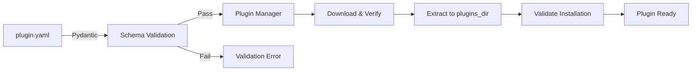

<!-- markdownlint-disable MD013 MD022 MD031 MD032 MD033 MD034 MD036 MD040 MD051 MD060 -->

# 🔌 Plugin Development Guide

> **Python Support:** 3.12, 3.13, 3.14 (Python 3.13 recommended)
> **Plugin System:** Manifest-driven (YAML-based) with automatic validation
> **Security:** SHA-256 checksum verification, retry logic, progress tracking
> **Last Updated:** January 7, 2026

## 📚 Table of Contents

- [Overview](#overview)
- [Quick Start](#quick-start)
- [Plugin Architecture](#plugin-architecture)
- [YAML Manifest Schema](#yaml-manifest-schema)
- [Plugin Types](#plugin-types)
- [Creating Your First Plugin](#creating-your-first-plugin)
- [Advanced Configuration](#advanced-configuration)
- [Testing Plugins](#testing-plugins)
- [Publishing Plugins](#publishing-plugins)
- [Best Practices](#best-practices)
- [Troubleshooting](#troubleshooting)
- [API Reference](#api-reference)

---

## 🎯 Overview

pyMediaManager (pyMM) uses a **manifest-driven plugin system** that allows external tools to be managed without writing Python code. Plugins are defined entirely through YAML manifests that describe:

- 📦 **Download Sources**: Direct URLs or GitHub releases
- 🔐 **Security**: SHA-256 checksums for integrity verification
- 📂 **Installation**: Extraction paths and directory structure
- ⚙️ **Configuration**: Command paths, executables, PATH registration
- 🔗 **Dependencies**: Optional plugin dependencies

### Key Benefits

✅ **No Code Required**: Pure data-driven configuration
✅ **Security**: No arbitrary code execution, sandboxed downloads
✅ **Portability**: Plugins install to external drives
✅ **Automatic Updates**: Version tracking and update checks
✅ **Validation**: Strict Pydantic schema validation

---

## 🚀 Quick Start

### 5-Minute Plugin Creation

1. **Create plugin directory**:

   ```bash
   mkdir -p plugins/mytool
   ```

2. **Create `plugin.yaml`**:
   ```yaml
   name: MyTool
   version: 1.0.0
   description: My awesome tool
   homepage: https://example.com/mytool
   mandatory: false
   enabled: true

   source:
     type: url
     uri: https://example.com/mytool-1.0.0-win64.zip
     checksum_sha256: "e3b0c44298fc1c149afbf4c8996fb92427ae41e4649b934ca495991b7852b855"
     file_size: 5242880

   command:
     path: bin
     executable: mytool.exe
     register_to_path: false

   dependencies: []
   ```

3. **Test plugin**:
   ```bash
   python -m pytest tests/test_plugin_manager.py -k "test_discover_plugins"
   ```

4. **Install in pyMM**:
   - Launch pyMM
   - Navigate to Plugin View
   - Click "Refresh Plugins"
   - Select "MyTool" and click "Install"

---

## 🏗️ Plugin Architecture

### Manifest-Driven Approach

pyMM uses a **strictly manifest-driven** plugin system. External tools are managed entirely by the core application based on YAML declarations—**no custom Python code is executed during plugin loading or installation**.



### Component Overview

| Component | Purpose | Technology |
|-----------|---------|------------|
| **Plugin Manifest** | Declarative configuration | YAML |
| **PluginManifestSchema** | Validation and type safety | Pydantic 2.5+ |
| **PluginManager** | Discovery, installation, lifecycle | Python 3.13 |
| **SimplePluginImplementation** | Download, extract, validate | aiohttp, shutil |

### Security Model

1. **No Code Execution**: Plugins cannot run arbitrary Python code
2. **Sandboxed Downloads**: Isolated temp directory, HTTPS only
3. **Integrity Verification**: SHA-256 checksum validation
4. **Fail-Fast Validation**: Strict schema enforcement

---

## 📋 YAML Manifest Schema

### Complete Schema Reference

```yaml
# Required Fields
name: string                    # Plugin name (alphanumeric, spaces allowed)
version: string                 # Semantic version (e.g., 2.47.1)
description: string             # Brief description
homepage: string                # Official website URL
mandatory: boolean              # Is plugin required for core functionality?
enabled: boolean                # Is plugin enabled by default?

# Source Configuration
source:
  type: string                  # "url" or "github"
  uri: string                   # Download URL or GitHub repo (owner/repo)
  asset_pattern: string         # (GitHub only) Regex for release asset
  checksum_sha256: string       # SHA-256 hash of download file
  file_size: integer            # File size in bytes (optional)

# Command Configuration
command:
  path: string                  # Relative path from plugin root to binary dir
  executable: string            # Executable filename
  register_to_path: boolean     # Add to system PATH?

# Dependencies (optional)
dependencies:
  - string                      # List of plugin names this depends on
```

### Field Validation Rules

| Field | Type | Required | Validation |
|-------|------|----------|------------|
| `name` | `str` | ✅ | 1-100 chars, alphanumeric + spaces/hyphens |
| `version` | `str` | ✅ | Semantic versioning (1.0.0, 2.1.3-beta) |
| `description` | `str` | ✅ | 1-500 chars |
| `homepage` | `str` | ✅ | Valid HTTP/HTTPS URL |
| `mandatory` | `bool` | ✅ | `true` or `false` |
| `enabled` | `bool` | ✅ | `true` or `false` |
| `source.type` | `str` | ✅ | `"url"` or `"github"` |
| `source.uri` | `str` | ✅ | URL or `owner/repo` format |
| `source.checksum_sha256` | `str` | ✅ | 64-char hex string |
| `source.file_size` | `int` | ❌ | Positive integer (bytes) |
| `command.path` | `str` | ✅ | Relative path (no `..`) |
| `command.executable` | `str` | ✅ | Filename with extension |
| `command.register_to_path` | `bool` | ✅ | `true` or `false` |
| `dependencies` | `list[str]` | ❌ | List of plugin names |

---

## 🎨 Plugin Types

### 1. URL-Based Plugins

Direct download from a static URL.

**Use Case**: Self-hosted binaries, stable tool versions

```yaml
name: MyTool
version: 3.2.1
description: Custom tool with direct download
homepage: https://example.com
mandatory: false
enabled: true

source:
  type: url
  uri: https://cdn.example.com/releases/mytool-3.2.1-windows-x64.zip
  checksum_sha256: "a1b2c3d4e5f6..."
  file_size: 15728640  # 15 MB

command:
  path: bin
  executable: mytool.exe
  register_to_path: true

dependencies: []
```

**Checksum Generation**:
```powershell
# PowerShell
Get-FileHash mytool-3.2.1-windows-x64.zip -Algorithm SHA256

# Output:
# Algorithm       Hash                                   Path
# ---------       ----                                   ----
# SHA256          A1B2C3D4E5F6...                       mytool-3.2.1-windows-x64.zip
```

---

### 2. GitHub Release Plugins

Download from GitHub Releases with asset pattern matching.

**Use Case**: Open-source tools with regular releases

```yaml
name: Git
version: 2.47.1
description: Distributed version control system
homepage: https://git-scm.com
mandatory: false
enabled: true

source:
  type: github
  uri: git-for-windows/git
  asset_pattern: "PortableGit-.*-64-bit\\.7z\\.exe$"
  checksum_sha256: "f9a9d5c1..."

command:
  path: cmd
  executable: git.exe
  register_to_path: true

dependencies: []
```

**Asset Pattern Matching**:
- Uses Python regex syntax
- Matches against release asset filenames
- Must escape special characters (`\.`, `\$`, etc.)
- Pattern is case-sensitive

**Example Patterns**:
```yaml
# Match specific version
asset_pattern: "tool-1\\.2\\.3-win64\\.zip$"

# Match any version with architecture
asset_pattern: "tool-.*-x64\\.zip$"

# Match portable or installer
asset_pattern: "(Portable|Setup)-.*\\.exe$"
```

---

### 3. Plugins with Dependencies

Plugins that require other plugins to function.

**Use Case**: Tools that depend on runtime libraries

```yaml
name: GitLFS
version: 3.5.1
description: Git extension for large file support
homepage: https://git-lfs.com
mandatory: false
enabled: false

source:
  type: github
  uri: git-lfs/git-lfs
  asset_pattern: "git-lfs-windows-v.*\\.exe$"
  checksum_sha256: "b5c6d7e8..."

command:
  path: ""
  executable: git-lfs.exe
  register_to_path: true

dependencies:
  - Git  # Requires Git plugin to be installed first
```

**Dependency Resolution**:
- Plugin Manager installs dependencies recursively
- Circular dependencies are detected and rejected
- Installation order: dependencies → dependent plugin

---

## 🛠️ Creating Your First Plugin

### Example: FFmpeg Plugin

Let's create a complete plugin for FFmpeg, a multimedia framework.

#### Step 1: Research the Tool

1. **Find official source**: https://ffmpeg.org/download.html
2. **Locate Windows builds**: https://github.com/BtbN/FFmpeg-Builds/releases
3. **Choose version**: 7.1 (latest stable)
4. **Download and verify**:
   ```powershell
   # Download
   Invoke-WebRequest -Uri "https://github.com/BtbN/FFmpeg-Builds/releases/download/latest/ffmpeg-master-latest-win64-gpl.zip" -OutFile "ffmpeg.zip"

   # Calculate SHA-256
   Get-FileHash ffmpeg.zip -Algorithm SHA256

   # Get file size
   (Get-Item ffmpeg.zip).Length
   ```

#### Step 2: Test Extraction

```powershell
# Extract to test directory
Expand-Archive -Path ffmpeg.zip -DestinationPath test-extract

# Verify structure
tree /F test-extract

# Test executable
.\test-extract\ffmpeg-master-latest-win64-gpl\bin\ffmpeg.exe -version
```

Expected output:
```
test-extract/
└── ffmpeg-master-latest-win64-gpl/
    ├── bin/
    │   ├── ffmpeg.exe
    │   ├── ffplay.exe
    │   └── ffprobe.exe
    ├── LICENSE.txt
    └── README.txt
```

#### Step 3: Create Manifest

```yaml
# plugins/ffmpeg/plugin.yaml
name: FFmpeg
version: 7.1.0
description: Complete multimedia framework for audio/video processing
homepage: https://ffmpeg.org
mandatory: false
enabled: false

source:
  type: github
  uri: BtbN/FFmpeg-Builds
  asset_pattern: "ffmpeg-master-latest-win64-gpl\\.zip$"
  checksum_sha256: "1a2b3c4d5e6f7890abcdef1234567890abcdef1234567890abcdef1234567890"
  file_size: 89478485  # ~85 MB

command:
  # Note: GitHub releases extract to subdirectory
  path: ffmpeg-master-latest-win64-gpl/bin
  executable: ffmpeg.exe
  register_to_path: true

dependencies: []
```

#### Step 4: Validate Schema

```python
# tests/test_ffmpeg_plugin.py
import yaml
from pathlib import Path
from app.plugins.plugin_schema import PluginManifestSchema

def test_ffmpeg_manifest_valid():
    """Test FFmpeg plugin manifest is valid."""
    manifest_file = Path("plugins/ffmpeg/plugin.yaml")

    with open(manifest_file) as f:
        data = yaml.safe_load(f)

    # Pydantic validation
    manifest = PluginManifestSchema(**data)

    assert manifest.name == "FFmpeg"
    assert manifest.version == "7.1.0"
    assert manifest.source.type == "github"
    assert len(manifest.source.checksum_sha256) == 64
```

Run validation:
```bash
pytest tests/test_ffmpeg_plugin.py -v
```

#### Step 5: Test Installation

```python
# Manual test script
import asyncio
from pathlib import Path
from app.plugins.plugin_manager import PluginManager

async def test_ffmpeg_install():
    plugins_dir = Path("D:/pyMM.Plugins")
    manifests_dir = Path("plugins")

    manager = PluginManager(plugins_dir, manifests_dir)
    manager.discover_plugins()

    print(f"Discovered plugins: {list(manager.plugins.keys())}")

    # Install FFmpeg
    success = await manager.install_plugin("FFmpeg", progress_callback=print_progress)

    if success:
        print("✅ FFmpeg installed successfully")
        plugin = manager.plugins["FFmpeg"]
        version = plugin.get_version()
        print(f"Version: {version}")
    else:
        print("❌ Installation failed")

def print_progress(current: int, total: int):
    percent = (current / total) * 100
    print(f"Progress: {percent:.1f}% ({current}/{total} bytes)")

if __name__ == "__main__":
    asyncio.run(test_ffmpeg_install())
```

---

## ⚙️ Advanced Configuration

### Multi-Executable Plugins

Some tools provide multiple executables (e.g., FFmpeg has `ffmpeg`, `ffplay`, `ffprobe`).

**Solution**: Use the primary executable in `command.executable`, access others programmatically.

```yaml
command:
  path: bin
  executable: ffmpeg.exe  # Primary tool
  register_to_path: true
```

**Accessing secondary executables**:
```python
plugin = plugin_manager.plugins["FFmpeg"]
ffmpeg_exe = plugin.get_executable_path()  # Returns .../bin/ffmpeg.exe
ffprobe_exe = ffmpeg_exe.parent / "ffprobe.exe"  # Same directory
```

---

### Versioned Command Paths

Tools that include version in directory name:

```yaml
# Example: Node.js portable
command:
  path: node-v20.11.0-win-x64  # Versioned directory
  executable: node.exe
  register_to_path: true
```

**Challenge**: Version changes require manifest update.

**Solution**: Use regex replacement (planned feature):

```yaml
# Future syntax
command:
  path: "node-v{version}-win-x64"
  executable: node.exe
  register_to_path: true
```

---

### Self-Extracting Archives

Some Windows tools use `.exe` self-extractors:

```yaml
source:
  type: url
  uri: https://example.com/tool-portable.exe
  checksum_sha256: "abc123..."
```

**Current Behavior**: PluginManager treats `.exe` files as executables, not archives.

**Workaround**: Use 7-Zip command-line extraction:

```yaml
# If tool provides .7z.exe self-extractor
source:
  uri: https://github.com/git-for-windows/git/releases/download/v2.47.1.windows.1/PortableGit-2.47.1-64-bit.7z.exe
```

Plugin Manager automatically detects `.7z.exe` and extracts with 7-Zip.

---

### Large File Downloads

For files >100MB, consider:

1. **Progress Callbacks**: Show download progress in UI
2. **Resume Support**: Plugin Manager supports HTTP range requests
3. **Timeout Configuration**: Adjust `config.plugins.download_timeout`

```yaml
# pyMM config/user.yaml
plugins:
  download_timeout: 600  # 10 minutes for large files
  parallel_downloads: 1  # Sequential for slow connections
```

---

## 🧪 Testing Plugins

### Unit Testing

```python
# tests/unit/test_custom_plugin.py
import pytest
from pathlib import Path
from app.plugins.plugin_manager import PluginManager
from app.plugins.plugin_schema import PluginManifestSchema
import yaml

@pytest.fixture
def plugin_manifest(tmp_path: Path) -> Path:
    """Create temporary plugin manifest."""
    manifest_dir = tmp_path / "mytool"
    manifest_dir.mkdir()

    manifest_file = manifest_dir / "plugin.yaml"
    manifest_file.write_text("""
name: MyTool
version: 1.0.0
description: Test tool
homepage: https://example.com
mandatory: false
enabled: true
source:
  type: url
  uri: https://example.com/mytool.zip
  checksum_sha256: "e3b0c44298fc1c149afbf4c8996fb92427ae41e4649b934ca495991b7852b855"
command:
  path: bin
  executable: mytool.exe
  register_to_path: false
dependencies: []
    """)

    return manifest_file

def test_manifest_schema_valid(plugin_manifest: Path):
    """Test manifest passes Pydantic validation."""
    with open(plugin_manifest) as f:
        data = yaml.safe_load(f)

    manifest = PluginManifestSchema(**data)
    assert manifest.name == "MyTool"

def test_plugin_discovery(tmp_path: Path, plugin_manifest: Path):
    """Test plugin is discovered by PluginManager."""
    plugins_dir = tmp_path / "plugins"
    manifests_dir = plugin_manifest.parent.parent

    manager = PluginManager(plugins_dir, manifests_dir)
    count = manager.discover_plugins()

    assert count == 1
    assert "MyTool" in manager.plugins

@pytest.mark.asyncio
async def test_plugin_download_mock(tmp_path: Path, mocker):
    """Test plugin download with mocked HTTP."""
    # Mock aiohttp response
    mock_response = mocker.AsyncMock()
    mock_response.status = 200
    mock_response.headers = {"Content-Length": "1024"}
    mock_response.content.iter_chunked = mocker.AsyncMock(
        return_value=[b"test" * 256]  # 1024 bytes
    )

    mock_session = mocker.AsyncMock()
    mock_session.get.return_value.__aenter__.return_value = mock_response

    mocker.patch("aiohttp.ClientSession", return_value=mock_session)

    # Create plugin
    from app.plugins.plugin_base import SimplePluginImplementation, PluginManifest

    manifest = PluginManifest(
        name="TestPlugin",
        version="1.0.0",
        mandatory=False,
        enabled=True,
        source_type="url",
        source_uri="https://example.com/test.zip",
        checksum_sha256="e3b0c44298fc1c149afbf4c8996fb92427ae41e4649b934ca495991b7852b855"
    )

    plugin = SimplePluginImplementation(manifest, tmp_path)

    # Download (will fail checksum but tests HTTP logic)
    try:
        result = await plugin.download()
    except Exception:
        pass  # Expected: checksum mismatch

    mock_session.get.assert_called_once()
```

### Integration Testing

```python
# tests/integration/test_plugin_workflow.py
import pytest
from pathlib import Path
from app.plugins.plugin_manager import PluginManager

@pytest.mark.integration
@pytest.mark.asyncio
async def test_full_plugin_lifecycle(tmp_path: Path):
    """Test complete plugin workflow: discover → install → validate."""
    # This test requires actual plugin manifest and download URL
    # Use small test file (<1MB) for fast execution

    manifests_dir = Path("plugins")
    plugins_dir = tmp_path / "plugins"
    plugins_dir.mkdir()

    manager = PluginManager(plugins_dir, manifests_dir)

    # Discover
    count = manager.discover_plugins()
    assert count > 0

    # Choose smallest plugin for testing
    test_plugin = min(
        manager.manifests.values(),
        key=lambda m: m.file_size or float('inf')
    )

    # Install
    success = await manager.install_plugin(test_plugin.name)
    assert success

    # Validate
    plugin = manager.plugins[test_plugin.name]
    assert plugin.validate_installation()

    # Get version
    version = plugin.get_version()
    assert version is not None
```

---

## 📤 Publishing Plugins

### Official Plugin Repository

pyMM maintains official plugins in `plugins/` directory:

```
plugins/
├── git/plugin.yaml
├── ffmpeg/plugin.yaml
├── exiftool/plugin.yaml
├── imagemagick/plugin.yaml
└── ...
```

**Contribution Process**:

1. **Fork Repository**:
   ```bash
   git clone https://github.com/mosh666/pyMM.git
   cd pyMM
   git checkout -b add-plugin-xyz
   ```

2. **Create Plugin**:
   ```bash
   mkdir plugins/xyz
   # Create plugins/xyz/plugin.yaml
   ```

3. **Test Plugin**:
   ```bash
   pytest tests/unit/test_plugin_manager.py -k xyz
   pytest tests/integration/ -k plugin
   ```

4. **Validate Quality**:
   ```bash
   # Lint
   ruff check plugins/xyz/plugin.yaml

   # Type check
   mypy app/plugins/

   # Security scan
   bandit -r app/plugins/
   ```

5. **Submit Pull Request**:
   ```bash
   git add plugins/xyz/
   git commit -m "feat(plugins): add XYZ plugin v1.2.3"
   git push origin add-plugin-xyz
   ```

   Open PR at: https://github.com/mosh666/pyMM/compare

---

### Community Plugin Distribution

For unofficial/experimental plugins:

1. **Create Repository**:
   ```
   my-pymm-plugins/
   ├── README.md
   ├── mytool/
   │   └── plugin.yaml
   └── anothertool/
       └── plugin.yaml
   ```

2. **Document Usage**:
   ```markdown
   # My pyMM Plugins

   ## Installation
   1. Download plugin manifest: `mytool/plugin.yaml`
   2. Copy to: `D:\pyMM\plugins\mytool\plugin.yaml`
   3. Restart pyMM
   4. Navigate to Plugin View → Refresh Plugins
   5. Install "MyTool"
   ```

3. **Version Management**:
   - Use semantic versioning in `version` field
   - Update `checksum_sha256` for each release
   - Maintain CHANGELOG.md

---

## ✅ Best Practices

### 1. Naming Conventions

| Element | Convention | Example |
|---------|-----------|---------|
| Plugin Name | TitleCase, official spelling | `Git`, `FFmpeg`, `DigiKam` |
| Directory | Lowercase, no spaces | `git/`, `ffmpeg/`, `digikam/` |
| Executable | Exact case, with extension | `git.exe`, `ffmpeg.exe` |

### 2. Version Pinning

**✅ DO**: Pin exact versions
```yaml
version: 2.47.1
source:
  uri: https://example.com/tool-2.47.1.zip
```

**❌ DON'T**: Use "latest" or floating versions
```yaml
version: latest  # Bad!
source:
  uri: https://example.com/tool-latest.zip
```

**Reason**: Ensures reproducible installations, prevents breaking changes.

---

### 3. Checksum Verification

**Always include SHA-256 checksums**:

```powershell
# Windows PowerShell
Get-FileHash tool.zip -Algorithm SHA256 | Select-Object Hash

# Linux/macOS
shasum -a 256 tool.zip
```

**Handling Checksum Changes**:
- If upstream updates file without version change, verify legitimacy
- Contact tool maintainer if suspicious
- Update checksum only after manual verification

---

### 4. File Size Hints

**Include `file_size` for large downloads**:

```yaml
source:
  uri: https://example.com/huge-tool.zip
  checksum_sha256: "abc123..."
  file_size: 524288000  # 500 MB
```

**Benefits**:
- Progress bar accuracy
- Early disk space validation
- Download completion verification

---

### 5. Path Registration

**Use `register_to_path: true` for command-line tools**:

```yaml
command:
  executable: git.exe
  register_to_path: true  # Makes 'git' available in CMD
```

**Use `register_to_path: false` for GUI applications**:

```yaml
command:
  executable: digikam.exe
  register_to_path: false  # Not a CLI tool
```

---

### 6. Dependency Management

**Minimize dependencies**:

```yaml
# ✅ Good: Only essential dependencies
dependencies:
  - Git

# ❌ Bad: Transitive dependencies
dependencies:
  - Git
  - Python  # Git doesn't need Python, user's project might
```

**Circular dependency detection**:

```yaml
# plugin-a.yaml
dependencies:
  - PluginB

# plugin-b.yaml
dependencies:
  - PluginA  # Error: circular dependency!
```

Plugin Manager will detect and reject circular dependencies.

---

### 7. Documentation

**Include comprehensive metadata**:

```yaml
name: MyTool
version: 3.2.1
description: |
  Comprehensive tool description with features:
  - Feature 1: Image processing
  - Feature 2: Video encoding
  - Feature 3: Batch operations
homepage: https://example.com/mytool
```

**Link to documentation**:

```yaml
# Add custom field (allowed by Pydantic extra="allow")
documentation: https://example.com/mytool/docs
license: MIT
repository: https://github.com/example/mytool
```

---

## 🐛 Troubleshooting

### Common Issues

#### 1. "Schema Validation Failed"

**Symptom**:
```
ERROR Plugin manifest validation failed: plugins/mytool/plugin.yaml
ValidationError: 1 validation error for PluginManifestSchema
source.checksum_sha256
  String should match pattern '^[a-f0-9]{64}$'
```

**Solution**: Verify checksum is 64-character hex string (no spaces, lowercase).

```powershell
# Correct format:
checksum_sha256: "a1b2c3d4e5f6..."

# Wrong format:
checksum_sha256: "A1B2C3D4E5F6..."  # Uppercase
checksum_sha256: "a1b2 c3d4 e5f6"    # Spaces
```

---

#### 2. "Checksum Mismatch"

**Symptom**:
```
ERROR Checksum verification failed for MyTool
Expected: abc123...
Actual:   def456...
```

**Causes**:
1. Downloaded file corrupted
2. Wrong checksum in manifest
3. Upstream file changed without version bump

**Solution**:
```powershell
# Re-download and calculate checksum
Invoke-WebRequest -Uri "https://example.com/tool.zip" -OutFile "tool-verify.zip"
Get-FileHash tool-verify.zip -Algorithm SHA256

# Compare with manifest
# If different, update manifest or report upstream issue
```

---

#### 3. "Extraction Failed"

**Symptom**:
```
ERROR Failed to extract MyTool: [WinError 32] The process cannot access the file
```

**Causes**:
1. Archive corrupted
2. Insufficient disk space
3. File in use by another process

**Solution**:
```python
# Enable debug logging
logging:
  level: DEBUG

# Retry installation with verbose output
```

---

#### 4. "Executable Not Found"

**Symptom**:
```
ERROR Validation failed: git.exe not found in D:\pyMM.Plugins\git\cmd\
```

**Causes**:
1. Wrong `command.path` in manifest
2. Archive structure differs from expected

**Solution**:
```powershell
# Manually extract and inspect structure
Expand-Archive tool.zip test-dir
tree /F test-dir

# Update manifest command.path to match actual structure
```

---

#### 5. "GitHub Asset Not Found"

**Symptom**:
```
ERROR No matching asset found for pattern: "tool-.*-win64\.zip$"
Available assets:
  - tool-1.2.3-windows-x64.zip
  - tool-1.2.3-linux-x64.tar.gz
```

**Solution**: Adjust `asset_pattern` to match available assets.

```yaml
# Before (wrong):
asset_pattern: "tool-.*-win64\\.zip$"

# After (correct):
asset_pattern: "tool-.*-windows-x64\\.zip$"
```

---

## 📚 API Reference

### PluginManifest Dataclass

```python
@dataclass
class PluginManifest:
    """Plugin manifest configuration."""

    name: str
    version: str
    mandatory: bool
    enabled: bool
    source_type: str  # 'url' or 'github'
    source_uri: str
    asset_pattern: str | None = None
    command_path: str = ""
    command_executable: str = ""
    register_to_path: bool = False
    dependencies: list[str] = field(default_factory=list)
    checksum_sha256: str | None = None
    file_size: int | None = None
```

---

### PluginBase Abstract Class

```python
class PluginBase(ABC):
    """Abstract base class for plugins."""

    def __init__(self, manifest: PluginManifest, install_dir: Path):
        """
        Initialize plugin.

        Args:
            manifest: Plugin manifest configuration
            install_dir: Directory where plugin will be installed
        """

    @abstractmethod
    async def download(
        self,
        progress_callback: Callable[[int, int], None] | None = None
    ) -> bool:
        """
        Download plugin binaries.

        Args:
            progress_callback: Optional callback for progress updates
                              (current_bytes, total_bytes) -> None

        Returns:
            True if download successful
        """

    @abstractmethod
    async def extract(self) -> bool:
        """
        Extract downloaded plugin archive.

        Returns:
            True if extraction successful
        """

    @abstractmethod
    def validate_installation(self) -> bool:
        """
        Validate that plugin is properly installed.

        Returns:
            True if plugin is installed and functional
        """

    @abstractmethod
    def get_version(self) -> str | None:
        """
        Get installed plugin version.

        Returns:
            Version string or None if not installed
        """

    def get_executable_path(self) -> Path | None:
        """
        Get path to plugin executable.

        Returns:
            Path to executable or None if not found
        """
```

---

### PluginManager Class

```python
class PluginManager:
    """Manager for application plugins."""

    def __init__(self, plugins_dir: Path, manifests_dir: Path):
        """
        Initialize plugin manager.

        Args:
            plugins_dir: Directory where plugins are installed
            manifests_dir: Directory containing plugin manifest YAML files
        """

    def discover_plugins(self) -> int:
        """
        Discover plugins from manifest files.

        Returns:
            Number of plugins discovered
        """

    async def install_plugin(
        self,
        plugin_name: str,
        progress_callback: Callable[[int, int], None] | None = None
    ) -> bool:
        """
        Install plugin with progress tracking.

        Args:
            plugin_name: Name of plugin to install
            progress_callback: Optional progress callback

        Returns:
            True if installation succeeded
        """

    def get_installed_plugins(self) -> list[str]:
        """
        Get list of installed plugin names.

        Returns:
            List of plugin names
        """

    def get_plugin_status(self, plugin_name: str) -> dict[str, Any]:
        """
        Get detailed status for a plugin.

        Args:
            plugin_name: Name of plugin

        Returns:
            Dictionary with keys:
              - installed: bool
              - version: str | None
              - enabled: bool
              - path: str | None
        """
```

---

## 📖 Additional Resources

### Official Documentation

- [Architecture Documentation](architecture.md)
- [User Guide](user-guide.md)
- [Contributing Guidelines](../CONTRIBUTING.md)

### External References

- [Pydantic Documentation](https://docs.pydantic.dev/)
- [Semantic Versioning](https://semver.org/)
- [YAML Specification](https://yaml.org/spec/1.2.2/)

### Example Plugins

Study official plugin manifests:

- [Git Plugin](../plugins/git/plugin.yaml)
- [FFmpeg Plugin](../plugins/ffmpeg/plugin.yaml)
- [ExifTool Plugin](../plugins/exiftool/plugin.yaml)

---

## 🤝 Community

### Getting Help

- **GitHub Issues**: https://github.com/mosh666/pyMM/issues
- **Discussions**: https://github.com/mosh666/pyMM/discussions
- **Email**: 24556349+mosh666@users.noreply.github.com

### Contributing

We welcome plugin contributions! See [CONTRIBUTING.md](../CONTRIBUTING.md) for:

- Code of Conduct
- Development setup
- Testing requirements
- PR submission process

---

**Document Version:** 1.0.0
**Last Updated:** January 7, 2026
**Maintainer:** @mosh666
**Status:** ✅ Current
